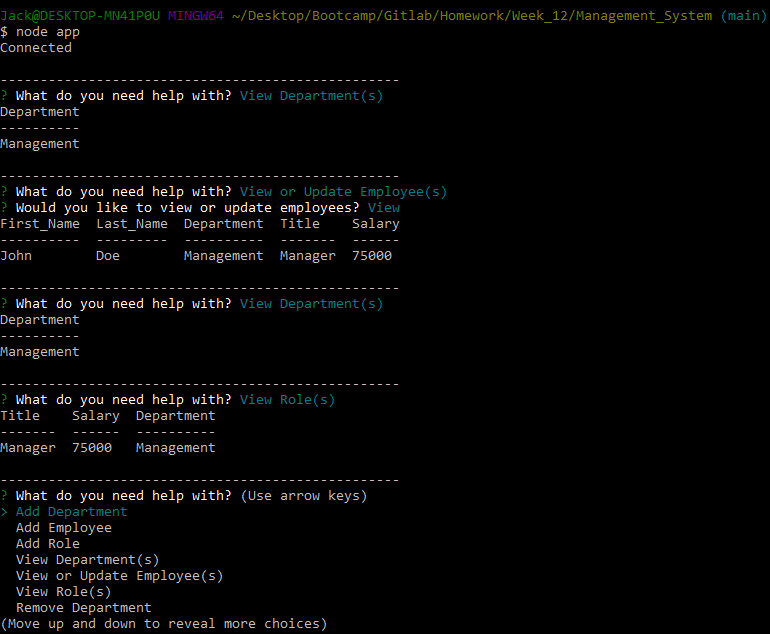

# Management_System

## Table of Contents
- [Description](#description)
- [Features](#features)
- [Use Instructions](#use-instructions)
- [Technology Used](#technology-used)
- [Authors](#authors)

## Description
A command line application that can be used to manage employee databases using SQL and Node. The application allows the user to add roles, employees, and departments, along with removing or updating any of the previously mentioned categories. Inquirer prompts the questions that the user will need in order to manage the database, and the Console.Table package is used to neatly display the data in the commmand line. SQL is the database language used in order to store all of the user's employee information.

## Features

- Add New Employees/Roles/Departments
- Remove Employees/Roles/Departments
- Update Employees/Roles/Departments

## Use Instructions
1. Clone/Fork/Download the repository.
2. Open the using your preffered command line interface.
3. Input `node app.js` to run the command line application.
4. To close the application use the `Shutdown` option in the menu.

## Technology Used
- JavaScript
- Node.js
- Inquirer 
- MySQL
- SQL
- Console.Table

## Authors
- Jack Ceballos